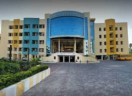

# G H Raisoni college of engineering nagpur.My name is **Harshita Jethani** I am doing **BCA** and I am in *2nd* year .
I am currently studying in **G.H.Raisoni college.** It is one of the best college in nagpur for engineering and all courses.
**G.H.Raisoni college** is an autonomous engineering college affiliated to Rashtrasant Tukdoji Maharaj Nagpur University and is located in nagpur. the college was established in 1996 and is now run by Raisoni Group. The Chairman is **Sunil Raisoni** and Director is **Sachin Untawale**.

[visit G.H Raisoni college](raisoni.net)
---

## Events

There are many events conducted in this college every year like

- Antaragini

- Fusion feistas

- dance competition

- singing competition

- blood donation camps

- sports and cultural events
  
Now if as study and study related events are discussed then there are various quiz competitions related to languages like `c`,`c++`,`java`,`python`,etc.
---

## Branches
1. G H Raisoni college of engineering Nagpur.
2. G H Raisoni university Saikheda.
3. G H Raisoni institute of business management, Jalgaon.
4. G H Raisoni institute of engineering & technology, Pune.
5. G H Raisoni university Amravati.
   
---

